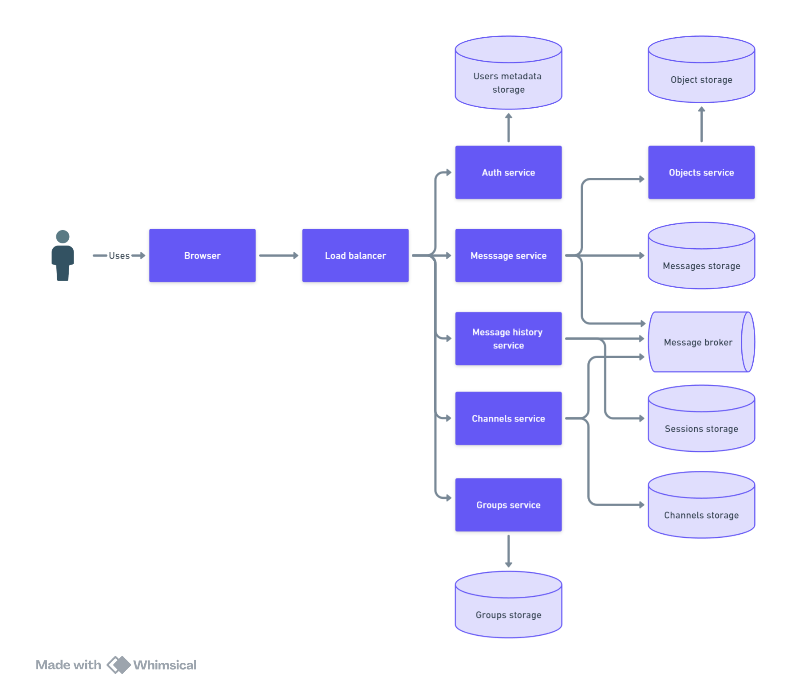
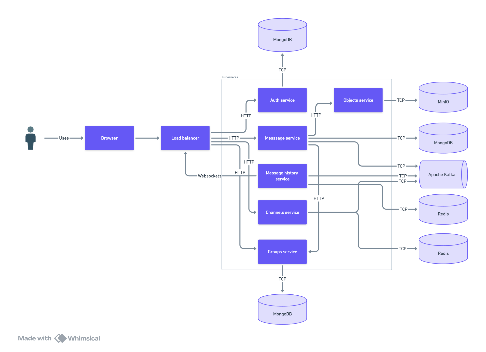

- [Цели](#цели)
- [Функциональные требования](#функциональные-требования)
- [Нефункциональные требования](#нефункциональные-требования)
- [Метрики](#метрики)
- [Оценка пропускной способности и ограничения](#оценка-пропускной-способности-и-ограничения)
  - [Пропускная способность](#пропускная-способность)
  - [Хранилище](#хранилище)
  - [Пропускная способность](#пропускная-способность-1)
  - [Схема компонентов](#схема-компонентов)
  - [Шаг 1 - простой дизайн](#шаг-1---простой-дизайн)
  - [Шаг 2 - дизайн с некоторыми техническими деталями](#шаг-2---дизайн-с-некоторыми-техническими-деталями)
  - [Шаг 3 - проектирование с учетом масштабирования и высокой доступности](#шаг-3---проектирование-с-учетом-масштабирования-и-высокой-доступности)
  - [Шаг 4 - cloud native дизайн для развертывания в AWS](#шаг-4---cloud-native-дизайн-для-развертывания-в-aws)
- [APIs](#apis)
- [События брокера сообщений](#события-брокера-сообщений)
- [Объекты данных](#объекты-данных)

Этот документ доступен на следующих языках: [английский](README.md), [русский](README_RU.md)

Ниже описан дизайн системы обмена сообщениями с двумя этапами реализации (локальный рынок и глобальный рынок)

# Цели
Наш заказчик хочет создать систему обмена сообщениями. Система должна быть способна обрабатывать относительно большое количество запросов. Пользователи будут отправлять текстовые сообщения с изображениями, аудио и двоичными файлами. Система должна уметь работать с группами и каналами. 

Наш клиент хотел бы начать проект с локального рынка, а затем выйти на глобальный рынок (этап №2).

# Функциональные требования
- Пользователь может зарегистрироваться и войти в систему
- Пользователь может отправить быстрое сообщение другому пользователю
- Сообщение может быть текстовым и содержать изображения
- Пользователь может иметь возможность найти другого пользователя
- Пользователь может просматривать всех своих друзей
- Пользователь может загрузить историю своих сообщений
- Пользователь может использовать группы
- Пользователь может использовать каналы
- Веб-приложение
- Мобильные и настольные клиенты (для этапа №2)
- Сообщение может содержать аудио и видео (для этапа №2)
- Сообщение может содержать двоичные файлы (для этапа №2)

# Нефункциональные требования
- High available
- Low latency
- High performance
- High scalable

# Метрики
- Общее количество пользователей: 10M
- DAU: 3M
- Каждый пользователь отправляет в среднем 100 сообщений в день
- Средний размер текстового сообщения: 2 КБ
- Средний размер изображения: 1 МБ
- В среднем изображений на сообщение: 5
- Размер обычного изображения: 5 МБ
- Максимальный размер группы: 100 пользователей
- Максимальный размер канала: 10K пользователей
- Максимальное время ожидания ответного сообщения: 1,5 секунды (общая задержка составляет около 300 мс).
- Один регион (локальный рынок)
- SLA: 99,99%
- Максимальный размер бинарного файла: до 500 МБ (для этапа №2)
- Глобальный рынок (для этапа №2)

# Оценка пропускной способности и ограничения
## Пропускная способность
Предположим, что у нас 3M DAU и каждый пользователь отправляет 10 сообщений в день. Это означает, что у нас будет следующее количество запросов:
- Всего личных сообщений в день: 3M * 100 = 300M
- Всего личных сообщений в секунду: 300M / 86400 = 3500 RPS * 2 (для чтения и записи) = 7000 RPS

Предположим, что у нас есть около 10K групп с 50 пользователями в каждой группе и 1K каналов с 1K пользователями в каждом канале с одним сообщением в день. Это означает, что у нас будет следующее количество запросов:
- Всего сообщений в группах в день: 10K * 50 * 100 = 50M
- Общее количество групповых сообщений в секунду: 50M / 86400 = 600 RPS * 2 = 1200 RPS
- Общее количество сообщений канала в день: 1K * 1K = 1M
- Общее количество сообщений канала в секунду: 1M / 86400 = 12 RPS

Общее количество запросов: 7000 + 1200 + 12 = 8200 RPS 

## Хранилище
Дано, что у нас 3M активных пользователей, и каждый пользователь пишет и читает 10 сообщений в день. Также у нас есть группы и каналы. Это означает, что у нас будет следующий объем данных:
- Общее количество сообщений в секунду: 8200 * 2KB = 16MB
- Общее количество изображений в секунду: 8200 * 1 МБ * 5 = 41 ГБ

| Тип                          | Ежедневно | Ежемесячно | Ежегодно |
| ---------------------------- | --------- | ---------- | -------- |
| Текст без реплик             | 1,3 ТБ    | 39 ТБ      | 468 ТБ   |
| Текст с 3-мя репликами       | 4 ТБ      | 117 ТБ     | 2 ПБ     |
| Изображения без реплик       | 3,5 ПБ    | 105 ПБ     | 1260 ПБ  |
| Изображения с 3-мя репликами | 10PB      | 300PB      | 3,6EB    |

## Пропускная способность
Исходя из приведенных выше расчетов, мы можем оценить пропускную способность, необходимую для нашей системы. Нам потребуется обрабатывать следующий объем текстовых данных и изображений: 5100 МБит/с

## Схема компонентов
## Шаг 1 - простой дизайн
Вот базовая схема компонентов для старта проектирования:

- **Message service** будет отвечать за отправку и получение сообщений. 
- **Statuses service** будет полезен для получения статусов сообщений и пользователей. 
- **Groups service** будет отвечать за управление группами и групповыми сообщениями. 
- **Channels service** будет отвечать за работу с каналами. 
- **Auth service** нужен для аутентификации пользователей. 

Рабочий процесс будет выглядеть следующим образом:
Отправитель регистрируется и входит в систему с помощью службы авторизации. Данные пользователя сохраняются в хранилище метаданных пользователя.

Отправитель отправляет сообщение получателю. Message service получит сообщение от отправителя со статусом "unreaded". Message service сохраняет это сообщение в message storage, а также помещает его в брокер сообщений.
После этого message history service получает сообщение из брокера сообщений и отправляет его получателю по протоколу WebSockets.
Получатель получит сообщение и изменит статус на "recieved". Отправитель получит ответ, что сообщение было получено.
После этого получатель прочитает сообщение и изменит статус на "readed". Отправитель получит ответ, что сообщение прочитано.

Session storage будет использоваться для хранения сессий websockets для каждого пользователя.

Пользователи могут создавать каналы с помощью channels service. Данные о каналах будут сохранены в channels storage. Эти данные не включают в себя название канала, описание и все идентификаторы пользователей в канале.
Когда пользователь отправляет сообщение в канал, служба сообщений будет помещена в брокер сообщений, и с помощью шаблона pub/sub сообщение будет отправлено всем пользователям в канале.

Group service создаст группу и сохранит ее в group storage. Данные группы включают в себя название группы, описание и идентификаторы всех пользователей в группе.
Когда пользователь отправляет сообщение в группу, message service получает идентификаторы пользователей из службы групп и отправляет событие брокеру сообщений. После этого сообщение будет отправлено всем пользователям в группе с помощью messages history service, как это было описано выше.

Изображения емкие в отличие от текста, и нам нужно хранить их в отдельном объектном хранилище. Сообщение содержит только URL на изображение в объектном хранилище.

Я спроектировал basic storage на этом шаге для упрощения.

## Шаг 2 - дизайн с некоторыми техническими деталями
Вот более подробная схема компонентов:
- Балансировщик нагрузки будет использоваться для распределения нагрузки между всеми сервисами.
- В качестве брокера сообщений мы можем использовать Apache Kafka. Это распределенная платформа (распреленный лог сообщений), которая может обрабатывать триллионы событий в день. Кроме того, с помощью Kafka мы можем использовать различные паттерны, такие как pub/sub и очередь. Следующее преимущество заключается в том, что Kafka - это распределенный лог, и мы можем хранить все события в Kafka в течение определенного времени (в зависимости от настроек времени хранения).
- Мы можем развернуть все сервисы в контейнерах Docker и оркестровать их с помощью Kubernetes. Он может работать с большим количеством контейнеров и автоматически масштабировать их в зависимости от потребностей.
- Для message storage мы можем использовать PostgreSQL. Это RDBMS база данных, которая может хранить данные в структурированном виде и JSON документах. Она очень быстрая и может обрабатывать большие объемы данных. Мы можем использовать ее для хранения всех сообщений.
- Для хранения данных каналов и групп мы также можем использовать PostgreSQL и хранить все данные каналов в отдельной коллекции в PostgreSQL.
- В качестве хранилища сессий мы можем использовать Redis. Redis - это база данных с  значениями key value, которая может хранить данные в памяти и работает очень быстро.
- Для хранения изображений и других BLOB-файлов мы можем использовать хранилище S3, например MinIO.

Здесь приведена схема с более подробными техническими характеристиками:

## Шаг 3 - проектирование с учетом масштабирования и высокой доступности
Для обеспечения высокой доступности нам нужно использовать несколько стратегий:
- Для обеспечения высокой доступности нам нужно использовать как минимум 3 реплики каждого сервиса. Если один из сервисов выйдет из строя, другие реплики примут на себя нагрузку.
- Мы должны использовать балансировщик нагрузки, чтобы распределить нагрузку между всеми репликами сервисов.
- Для обеспечения высокой доступности также следует использовать не менее 3 реплик каждой базы данных. Если одна из баз данных выйдет из строя, остальные реплики примут на себя нагрузку.
- Чтобы обеспечить SLA: 99,99 %, мы должны использовать активный мониторинг всех сервисов и баз данных. Кроме того, мы должны развернуть все сервисы в разных зонах доступности, чтобы справиться с нагрузкой, если одна из зон доступности выйдет из строя.

Для масштабирования нашей системы необходимо сделать следующее:
- Мы должны масштабировать наши сервисы горизонтально. Мы можем использовать Kubernetes для автоматического масштабирования сервисов в зависимости от нагрузки. 
- Мы можем использовать партиции Kafka для распределения нагрузки между всеми брокерами Kafka. Kafka может обрабатывать большое количество данных и масштабироваться горизонтально за счет добавления новых брокеров.
- Мы можем использовать партиционирование PostgreSQL, чтобы распределить нагрузку между всеми экземплярами PostgreSQL.
- Хранилище S3 может обрабатывать большие объемы данных и по умолчанию может горизонтально масштабироваться путем добавления новых узлов хранения.
- 
Чтобы обеспечить высокую производительность около 3800 RPS для чтения и 350RPS для записи, нам нужно использовать следующие стратегии:
- Мы должны использовать высокопроизводительные алгоритмы, используя Golang с горутинами для обработки большого количества запросов. Опять же, мы можем использовать Kubernetes для автоматического масштабирования наших сервисов в зависимости от нагрузки.
- Для чтения сообщений мы можем использовать событийную согласованность. 

## Шаг 4 - cloud native дизайн для развертывания в AWS 
Неплохой идеей будет развернуть нашу систему в облаке AWS. Вот рекомендуемая архитектура для развертывания нашей системы в AWS:
- Amazon EKS for deploying Kubernetes clusters.
- Amazon RDS for deploying PostgreSQL databases.
- Amazon S3 for storing images and other BLOBs.
- Amazon ElastiCache for storing sessions.
- Amazon Kafka for deploying Kafka clusters.
- Amazon Cognito for user authentication.
- Amazon CloudWatch for monitoring all services and databases.
- Amazon Route 53 for DNS.
- Amazon CloudFront for caching images and other BLOBs.

# APIs
Вот список API, которые нам нужно будет реализовать:
- POST /register
- POST /login
- GET /users/{user_id}
- POST /messages
- GET /messages
- GET /messages/{message_id}
- POST /groups
- GET /groups/{group_id}/messages
- POST /groups/{group_id}/message
- POST /channels
- GET /channels/{channel_id}/messages
- POST /channels/{channel_id}/message

Некоторые дополнительные сведения приведены в файле [APIS](apis.md).

# События брокера сообщений
Вот список событий, которые нам нужно будет реализовать:
- message_sent
- message_recieved
- channel_message_sent
- group_message_sent

# Объекты данных

- Messages
- Users
- Sessions
- Groups
- Channels
- BLOBs
