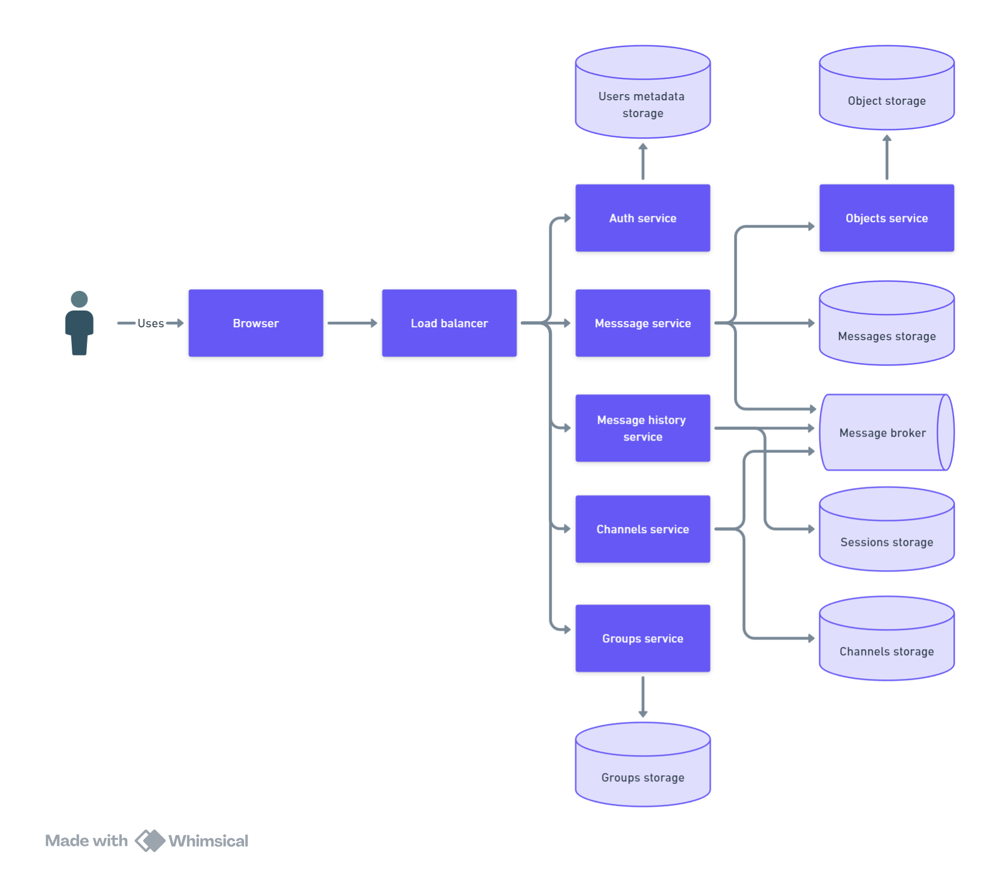

- [Business goals](#business-goals)
- [Functional Requirements](#functional-requirements)
- [Non-Functional Requirements](#non-functional-requirements)
- [Metrics](#metrics)
- [Capacity estimation and constraints](#capacity-estimation-and-constraints)
  - [Bandwidth](#bandwidth)
  - [Storage](#storage)
  - [Bandwidth](#bandwidth-1)
- [Component diagram](#component-diagram)
  - [Step 1 - simple design](#step-1---simple-design)
  - [Step 2 - design with some technical details](#step-2---design-with-some-technical-details)
  - [Step 3 - design with scaling and high availability](#step-3---design-with-scaling-and-high-availability)
  - [Step 4 - cloud native design for deploying in AWS](#step-4---cloud-native-design-for-deploying-in-aws)
- [APIs](#apis)
- [Message broker events](#message-broker-events)
- [Data objects](#data-objects)

Basic messenger system design with two s tages of impletentation (local market and global market)

# Business goals
Our customer wants to make a messenger system that can be used by people to communicate with each other. The system should be able to handle a large number of users and messages. Users should use text messages with images, audio, and binary attachments. The system should be able to handle groups and channels. 

Client would like to start with a local market and then expand to a global market (stage №2).

# Functional Requirements
- User can register and login
- User can send rapid message to another user
- Message can be text and images
- user can search for another user
- User can view all user friends
- User can load his messages history
- User can use groups
- User can use channels
- Web clients
- Mobile and desktop clients (for stage №2)
- Message can contains audio and video (for stage №2)
- Message can contains binaries (for stage №2)

# Non-Functional Requirements
- High available
- Low latency
- High performance
- High scalable

# Metrics
- Total number of users: 10M
- DAU: 3M
- Every user sends 100 messages per day
- Overall message size: 2KB
- Overall image size: 1MB
- Overall images per message: 5
- Regular image size: 5MB
- Maximum group size: 100 users
- Maximum channel size: 10K users
- Maximum time for response message: 1.5 seconds (overall latency is about 300ms)
- One region
- SLA: 99.99%
- Maximum binary size: up to 500MB (for stage №2)
- Global market (for stage №2)

# Capacity estimation and constraints
## Bandwidth
Lets assume that we have 3M DAU and every user sends 10 messages per day. This means that we will have the following amount of requests:
- Total personal messages per day: 3M * 100 = 300M
- Total personal messages per second: 300M / 86400 = 3500 RPS * 2 (for reading and writing) = 7000 RPS

Lets assume that we have about 10K groups with 50 users in each group and 1K channels with 1K users in each channel with only one message a day. This means that we will have the following amount of requests:
- Total group messages per day: 10K * 50 * 100 = 50M
- Total amount of group messages per second: 50M / 86400 = 600 RPS * 2 = 1200 RPS
- Total channel messages per day: 1K * 1K = 1M
- Total amount of channel messages per second: 1M / 86400 = 12 RPS

Total amount: 7000 + 1200 + 12 = 8200 RPS 

## Storage
Lets assume that we have 3M active users and every user writes and reads 10 messages per day. This means that we will have the following amount of data:
- Total messages amount per second: 8200 * 2KB = 16MB
- Total images amount per second: 8200 * 1MB * 5 = 41GB

| Type                    | Daily | Monthly | Yearly |
| ----------------------- | ----- | ------- | ------ |
| Text withous replicas   | 1.3TB | 39TB    | 468TB  |
| Text with 3x replicas   | 4TB   | 117TB   | 2PB    |
| Images withous replicas | 3.5PB | 105PB   | 1260PB |
| Images with 3x replicas | 10PB  | 300PB   | 3.6EB  |

## Bandwidth
Based on the above calculations, we can estimate the bandwidth required for our system. We will need to handle the following amount of text and images data: 5100MBit/s

# Component diagram
## Step 1 - simple design
Here is a basic diagram of the components to start with:

- **Message service** will be responsible for sending and receiving messages. 
- **Statuses service** will be usefull for getting statuses of messages and users. 
- **Groups service** will be responsible for managing groups and group messages. 
- **Channels service** will be responsible for handling channels. 
- **Auth service** we need for user authentication. 

Workflow will be as follows:
The sender will register and login using the auth service. User data stores in the user metadata storage.

Sender sends a message to reciever. The message service will receive the message from sender with status "unreaded". Message service save this message to message storage and also put it into the message broker.
After that message history service gets message from message broker and send it to the receiver using the WebSockets protocol.
The receiver will get the message and change the status to "recieved". The sender will get a response that the message was recieved.
After that the receiver will read the message and change the status to "readed". The sender will get a response that the message was readed.

Session storage will be used to storage websockets sessions for each user.

Users can create channels using the channels service. The channels data will be saved to the channels storage. This data uncludes the channel name, description, and all users_ids in the channel.
When the user sends a message to the channel, the message service will be put into the message broker and using pub/sub pattern the message will be sent to all users in the channel.

The group service will create a group and save it to the group storage. The group data includes the group name, description, and all users_ids in the group.
When the user sends a message to the group, the message service will get the user_ids from the group service and send the event to the message broker. After that the message will be sent to all users in the group using the messages history service as it was described above.

Images are heavy and we need to store them in a separate object storage. Message contains only the link to the image in the object storage.

I put a basic storage on this step just for simplification.

## Step 2 - design with some technical details
Here is a more detailed diagram of the components:
- Load balancer will be used to distribute the load between all the services.
- We could use Apache Kafka as a message broker. It is a distributed streaming platform that can handle trillions of events a day. And also we could use different patterns like pub/sub and queue using Kafka. The next benefit is that Kafka is a distributed log and we can store all events in Kafka for a long time (depending on retention time settings).
- We could deploy all services in Docker containers and orchestrate them using Kubernetes. It can handle a large number of containers and scale them automatically depending our needs.
- We could use PostgreSQL as a message storage. PostgreSQL is a NoSQL database that can store data in JSON-like documents. It is very fast and can handle a large amount of data. We can use it to store all messages.
- For storing channels and groups data we also can use PostgreSQL and store all channels data in a separate collection in PostgreSQL.
- We could use Redis as a session storage. Redis is a key-value database that can store data in memory and is very fast. We can use it to store the sessions of all users.
- For storing images and other BLOBs we could use S3 storage like MinIO for example.

Here is the diagram with more technical details:

## Step 3 - design with scaling and high availability
To handle high availability we need use several strategies:
- We need to use at least 3 replicas of each service to handle high availability. If one of the services goes down, the other replicas will handle the load.
- We should use a load balancer to distribute the load between all the replicas of the services.
- We should use at least 3 replicas of each database to handle high availability. If one of the databases goes down, the other replicas will handle the load.
- To handle SLA: 99.99% we need to use active monitoring of all services and databases and handle all errors as soon as possible. Also we should deploy all services in different availability zones to handle the load if one of the availability zones goes down.

To scale our system we should do the following:
- We should scale our services horizontally. We can use Kubernetes to scale our services automatically depending on the load. Kubernetes can handle a large number of containers and scale them automatically.
- We could use Kafka partitions to handle the load between all the Kafka brokers. Kafka can handle a large amount of data and can scale horizontally by adding more brokers.
- We could use PostgreSQL sharding to handle the load between all the PostgreSQL instances. PostgreSQL can handle a large amount of data and can scale horizontally by adding more instances.
- S3 storage can handle a large amount of data and can scale horizontally by adding more storage nodes by default.

To handle high performance about 3800 RPS for reading and 350RPS for writing we need to use the following strategies:
- We should use high-performance algorithms using Golang with Goroutines to handle a large number of requests. Again we can use Kubernetes to scale our services automatically depending on the load.
- We can use eventual consistency for reading messages. 

## Step 4 - cloud native design for deploying in AWS 
It's a good idea to deploy our system in the AWS cloud. Here is a recomended architecture for deploying our system in AWS:
- Amazon EKS for deploying Kubernetes clusters.
- Amazon RDS for deploying PostgreSQL databases.
- Amazon S3 for storing images and other BLOBs.
- Amazon ElastiCache for storing sessions.
- Amazon Kafka for deploying Kafka clusters.
- Amazon Cognito for user authentication.
- Amazon CloudWatch for monitoring all services and databases.
- Amazon Route 53 for DNS.
- Amazon CloudFront for caching images and other BLOBs.

# APIs
Here is a list of APIs that we will need to implement:
- POST /register
- POST /login
- GET /users/{user_id}
- POST /messages
- GET /messages
- GET /messages/{message_id}
- POST /groups
- GET /groups/{group_id}/messages
- POST /groups/{group_id}/message
- POST /channels
- GET /channels/{channel_id}/messages
- POST /channels/{channel_id}/message

Some additional details provided in the [APIS](apis.md) file.

# Message broker events
Here is a list of events that we will need to implement:
- message_sent
- message_recieved
- channel_message_sent
- group_message_sent

# Data objects

- Messages
- Users
- Sessions
- Groups
- Channels
- BLOBs
